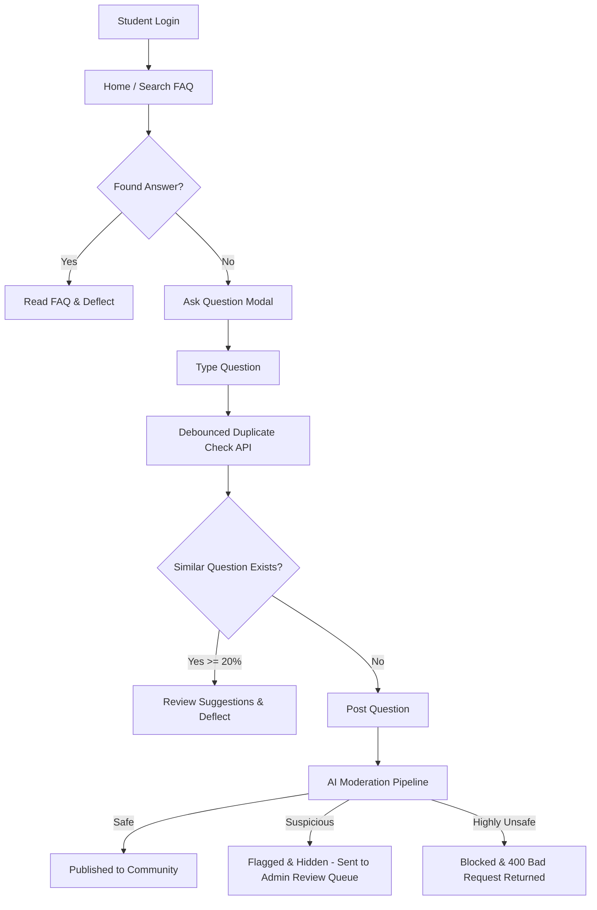
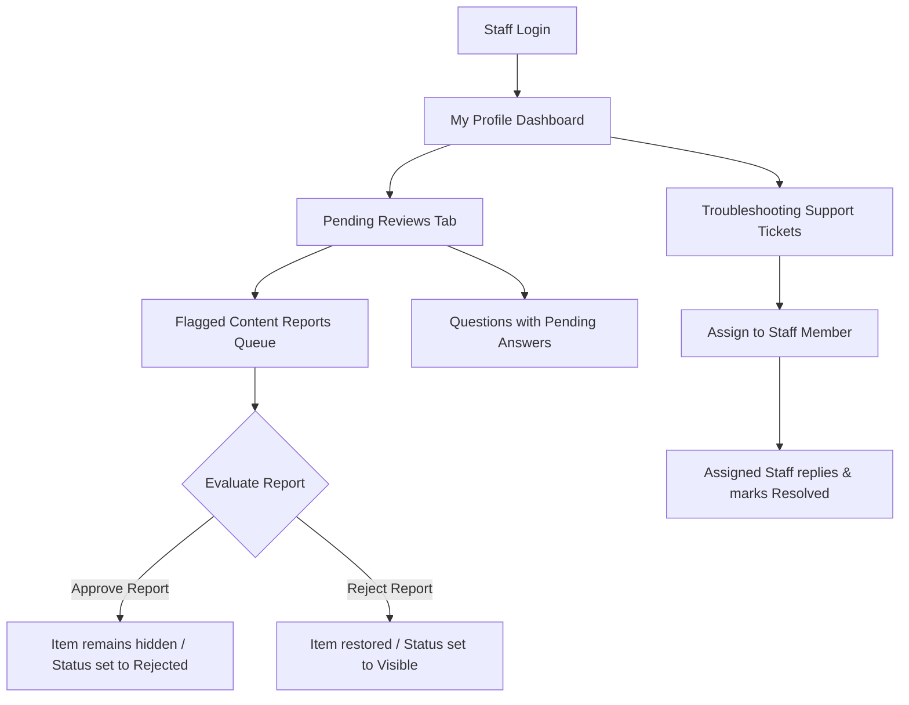

# VicharanaShala Q&A & Troubleshooting Platform — Context & Architecture

This document provides a comprehensive overview of the system architecture, technology stack, user workflows, feature implementations, and engineering challenges resolved in the repository.

---

## 1. Project Overview

The **VicharanaShala Q&A and Troubleshooting Platform** is a collaborative knowledge sharing portal and support ticketing application tailored for educational institutions. It serves two primary functions:
1. **Public Q&A & FAQ Ecosystem**: Enables students to search, ask, and answer community questions. Verified answers can be promoted to official FAQs to preemptively answer future queries.
2. **Private Troubleshooting System**: An isolated ticketing workflow for students to report private technical, login, or sensitive issues directly to administrators/moderators.

The platform is designed with automated moderation and duplicate prevention systems to maintain high content quality, minimize administrator overhead, and ensure a safe community environment.

---

## 2. Tech Stack

### Frontend
- **Framework**: React.js (bootstrapped with Vite)
- **Styling**: Vanilla CSS (providing high customizability, animations, and clean dark mode panels)
- **Routing**: React Router Dom
- **Icons**: Lucide React
- **API Client**: Axios with interceptors for JWT header injection

### Backend
- **Runtime**: Node.js
- **Framework**: Express.js
- **Database**: MongoDB hosted on MongoDB Atlas
- **ODM**: Mongoose
- **Authentication**: JSON Web Tokens (JWT) for access and refresh tokens, coupled with bcrypt password hashing

### AI & Natural Language Processing (NLP)
- **Vector Search Engine**: MongoDB Atlas Vector Search
- **Embeddings Generators**: OpenAI `text-embedding-3-small` (1536 dims) or Gemini `text-embedding-004` (768 dims) REST APIs
- **Moderation Model**: `unitary/toxic-bert` hosted on Hugging Face Serverless Inference API
- **Fallback Engines**: Local Regular Expression / word-lists (for moderation) and custom Jaccard Similarity / Overlap coefficients (for duplicate search)

---

## 3. User Journey & Workflows

### Student Journey

1. **Onboarding & Authentication**: Students register and log in to obtain access/refresh tokens.
2. **Search & Preemption**: Students type questions. The interface performs a debounced search to suggest highly relevant existing questions.
3. **Troubleshooting Ticket Submission**: If a student faces a private technical problem:
   - They click the **Troubleshooting** button in the Navbar.
   - They fill out a private ticket specifying a category (`'technical'`, `'login'`, `'other'`) and optionally uploading a screenshot.
   - They engage in a private, chronological discussion thread with the assigned staff member.
4. **Community Engagement**: Students read and upvote answers, mark best answers, bookmark queries, and report inappropriate content.

---

### Moderator & Administrator Journey

1. **Moderation Queue**: Accesses flagged content (AI-flagged or user-reported questions/answers) with visible details on *who* flagged it (User vs. AI Auto-Moderation) and the *reason* (toxicity scores or matching triggers).
2. **Review Decisions**: Approves report (soft-deletes violating content) or rejects report (restores content back to public lists).
3. **Ticket Resolution**: Browse the support ticketing queue, assign tickets to specific staff members, message the student in the private thread, and mark the issue as resolved.
4. **FAQ Promotion**: Promote high-quality resolved community questions into official FAQs.

---

## 4. Features Implemented

### I. Semantic Duplicate Question Detection
- **Intent Inferences**: Tokenizes, stems, and filters the query to classify it into 11 domains (e.g. `deployment`, `authentication`, `hostel`, `academics`).
- **Internal Concept Expansion**: Expands queries with technical synonym maps (e.g. mapping `MERN` or `React` to `deploy`, `host`, `aws`, `vercel`).
- **Slang & Multilingual Hinglish Translations**: Translates common Hinglish words (`kab` -> `when`, `milega` -> `receive`) and slang (`broken` -> `error`, `slow` -> `latency`).
- **Similarity Scorer**: Calculates a hybrid score mixing:
  - Jaccard Similarity (40%) and Overlap Containment Coefficient (60%).
  - Intent Compatibility Penalty (multiplies by `0.15` penalty if primary intents differ).
  - Usefulness Boosts (+0.08 for official FAQs, +0.05 for accepted answers, +0.05 for recent questions).
  - Literal Fuse.js fuzzy character matching (30% weight) blended with semantic analysis (70% weight).
- **Result Output**: Returns ranked suggestions >= 20% relevance and stops users from posting direct duplicates.

### II. AI Moderation System
- **API Interception**: Intercepts `POST /questions` and `POST /answers`. Automatically approves staff submissions.
- **Classification Engine**:
  - **Safe**: Auto-approved and published.
  - **Suspicious (Confidence 0.35 - 0.85)**: Status set to `'flagged'`. Content is hidden and placed in the admin moderation queue by creating a medium-severity `Report`.
  - **Highly Unsafe (Confidence > 0.85)**: Returns `400 Bad Request` with `AI_MODERATION_BLOCKED`. Submissions are saved as `'deleted'`/`'rejected'` and logged as a high-severity `Report`.
- **Dual-Category Local Fallback**: Regex checks for severe words (slurs, F-words) resulting in instant blocks, and mild words ("stupid", "idiot") resulting in flagged status. Features spam pattern matchers (e.g., casinos, work-from-home scams) and capital letter ratio/nonsense filters. Falls back automatically if Hugging Face is slow, offline, or rate-limited.

### III. Troubleshooting Ticketing System
- **Timeline & Categorization**: Private tickets categorized under `'technical'`, `'login'`, or `'other'`.
- **Assignment System**: Administrators can assign tickets to any moderator/administrator in the system using an assignment dropdown.
- **Assignee-Locked Controls**: Restricts replying and marking solved to the assigned moderator (or any moderator if unassigned). Other staff members view a read-only view with a disclaimer banner.

### IV. User Content Reporting
- **Report Actions**: Logged-in non-authors can click "Report" on any public question or answer.
- **Rules**: Prevents reporting of questions/answers authored by administrators (returns `403 Forbidden`).
- **Queue**: Items reported go directly to the administrator's review queue on the dashboard.

### V. Live Semantic Similar Question & FAQ Suggestions (MongoDB Atlas Vector Search)
- **Embedding Generation**: Automatically generates vector representations of question titles using Gemini (`text-embedding-004`), OpenAI (`text-embedding-3-small`), or Hugging Face, falling back to a deterministic hashing mock vectorizer in offline/keyless local development modes.
- **Atlas Vector Search**: Queries the `questions` collection using MongoDB `$vectorSearch` aggregations. Re-ranks similar questions and FAQs using metadata boosts (recency, views, FAQ status, and accepted answers).
- **Graceful Fallbacks**: If the search index is not yet built, the environment lacks Atlas capabilities, or the system is offline, the backend intercepts search errors and falls back to our local Jaccard + Overlap NLP similarity matching engine.
- **Background Sync**: Runs a migration task at startup that backfills missing embeddings for historical questions.

---

## 5. Challenges Faced & Solutions

### 1. Duplicate Check Collisions during Testing
- **Problem**: Testing the AI moderation system with realistic queries triggered the duplicate detector because previous tests had already created questions with similar titles/meanings.
- **Solution**: Updated integration test suites to use unique, randomized semantic concepts (e.g., student library card procedures, cafeteria kitchen complaints, and midterm examination datesheets) and implemented a cleanup script in the `finally` hook of `test_ai_moderation.js` that purges all created test questions, answers, reports, and temporary users from the database.

### 2. Hugging Face Inference API Latency & Availability
- **Problem**: Serverless models can take time to load (cold starts) or return `503 Service Unavailable`, which could block user submissions or fail silently.
- **Solution**: Developed a robust, dual-tier local moderation engine (using regex lists split into `SEVERE` and `MILD` words). The backend always evaluates local rules first (instantly blocking severe abuse) and defaults gracefully to the local engine's decisions on Hugging Face timeouts (capped at 5 seconds) or connection failures.

### 3. Mongoose refPath Schema Lookup Failures
- **Problem**: When populating the `targetId` in the `Report` schema, Mongoose failed to resolve model name references dynamically because model keys were registered with capitalization mismatch (`Question` vs `'question'`).
- **Solution**: Registered lowercase aliases for both models in `Question.js` and `Answer.js` (`mongoose.model('question', questionSchema)` and `mongoose.model('answer', answerSchema)`) to allow smooth dynamic `refPath` lookups in reports.

### 4. Admin Dashboard Visibility of Flag Origin
- **Problem**: Administrators had no way of knowing whether a reported item was caught by the automated AI filter or reported by a user, nor could they see the triggering toxicity scores.
- **Solution**: Updated the dashboard report cards in `MyProfile.jsx` to render a custom `AI Auto-Moderation` badge if `reportedBy` is null, or display the reporter's username. Additionally, the exact API scores or matching local rule details are printed in an italicized details card.

### 5. MongoDB Atlas Vector Search Index & Offline/Key Fallback Integration
- **Problem**: MongoDB Atlas Vector Search indexes can take time to provision or fail entirely when deploying locally (since local MongoDB does not support search indexes), and embedding APIs require keys/internet that might not be available in all developer environments.
- **Solution**: Implemented dynamic import hooks that try to programmatically build the index on database connection. Built a resilient embedding utility that supports OpenAI/Gemini/HF and falls back to deterministic LCG mock vectorization when offline. We then catch any errors from the `$vectorSearch` pipeline and gracefully redirect queries to our custom local Jaccard/Overlap NLP matcher, ensuring 100% test compatibility and zero runtime crashes.
