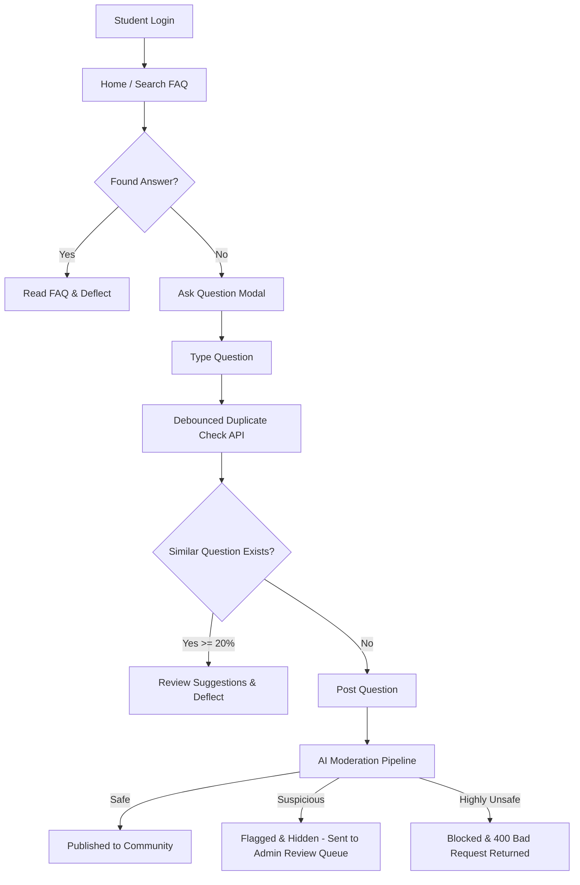
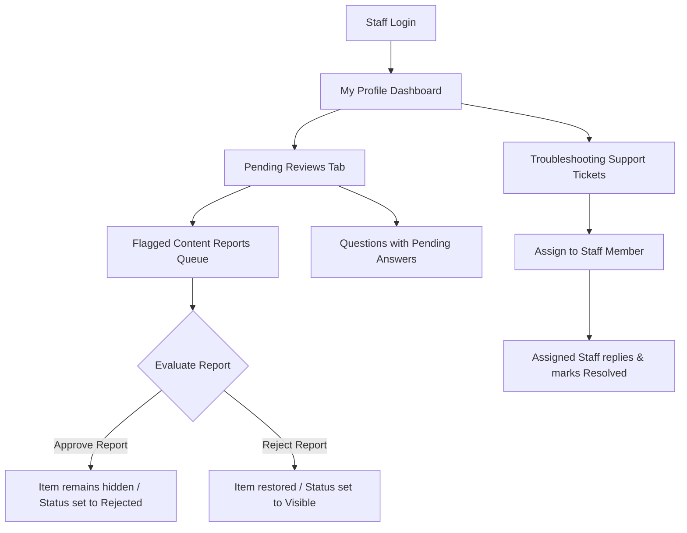

# VicharanaShala — AI-Assisted FAQ Portal

This document provides a comprehensive overview of the system architecture, technology stack, user workflows, feature implementations, and engineering challenges resolved in the repository.

---

## 1. Project Overview

The **VicharanaShala — AI-Assisted FAQ Portal** is a collaborative doubt solving portal and support ticketing application tailored for the Vicharanashala Summershiip 2026 program. It serves two primary functions:
1. **Public Q&A & FAQ Ecosystem**: Enables students to search, ask, and answer community questions. Verified answers can be promoted to official FAQs to preemptively answer future queries.
2. **Private Troubleshooting System**: An isolated ticketing workflow for students to report private technical, login, or sensitive issues directly to administrators/moderators.

The platform is designed with automated moderation and duplicate prevention systems to maintain high content quality, minimize administrator overhead, and ensure a safe community environment.

---

## 2. Tech Stack

### Frontend
- **Framework**: React.js (bootstrapped with Vite)
- **Styling**: Vanilla CSS (providing high customizability, animations, and clean dark mode panels)
- **Routing**: React Router Dom
- **Icons**: Lucide React
- **API Client**: Axios with interceptors for JWT header injection

### Backend
- **Runtime**: Node.js
- **Framework**: Express.js
- **Database**: MongoDB hosted on MongoDB Atlas
- **ODM**: Mongoose
- **Authentication**: JSON Web Tokens (JWT) for access and refresh tokens, coupled with bcrypt password hashing

### AI & Natural Language Processing (NLP)
- **Vector Search Engine**: MongoDB Atlas Vector Search
- **Embeddings Generators**: OpenAI `text-embedding-3-small` (1536 dims) or Gemini `text-embedding-004` (768 dims) REST APIs
- **Moderation Model**: `unitary/toxic-bert` hosted on Hugging Face Serverless Inference API
- **Fallback Engines**: Local Regular Expression / word-lists (for moderation) and custom Jaccard Similarity / Overlap coefficients (for duplicate search)

---

## 3. User Journey & Workflows

### Student Journey

1. **Onboarding & Authentication**: Students register and log in to obtain access/refresh tokens.
2. **Search & Preemption**: Students type questions. The interface performs a debounced search to suggest highly relevant existing questions.
3. **Troubleshooting Ticket Submission**: If a student faces a private technical problem:
   - They click the **Troubleshooting** button in the Navbar.
   - They fill out a private ticket specifying a category (`'technical'`, `'login'`, `'other'`) and optionally uploading a screenshot.
   - They engage in a private, chronological discussion thread with the assigned staff member.
4. **Community Engagement**: Students read and upvote answers, mark best answers, bookmark queries, and report inappropriate content.

---

### Moderator & Administrator Journey

1. **Moderation Queue**: Accesses flagged content (AI-flagged or user-reported questions/answers) with visible details on *who* flagged it (User vs. AI Auto-Moderation) and the *reason* (toxicity scores or matching triggers).
2. **Review Decisions**: Approves report (soft-deletes violating content) or rejects report (restores content back to public lists).
3. **Ticket Resolution**: Browse the support ticketing queue, assign tickets to specific staff members, message the student in the private thread, and mark the issue as resolved.
4. **FAQ Promotion**: Promote high-quality resolved community questions into official FAQs.

---

## 4. Features Implemented

### I. Semantic Duplicate Question Detection
- **Intent Inferences**: Tokenizes, stems, and filters the query to classify it into 11 domains (e.g. `deployment`, `authentication`, `hostel`, `academics`).
- **Internal Concept Expansion**: Expands queries with technical synonym maps (e.g. mapping `MERN` or `React` to `deploy`, `host`, `aws`, `vercel`).
- **Slang & Multilingual Hinglish Translations**: Translates common Hinglish words (`kab` -> `when`, `milega` -> `receive`) and slang (`broken` -> `error`, `slow` -> `latency`).
- **Similarity Scorer**: Calculates a hybrid score mixing:
  - Jaccard Similarity (40%) and Overlap Containment Coefficient (60%).
  - Intent Compatibility Penalty (multiplies by `0.15` penalty if primary intents differ).
  - Usefulness Boosts (+0.08 for official FAQs, +0.05 for accepted answers, +0.05 for recent questions).
  - Literal Fuse.js fuzzy character matching (30% weight) blended with semantic analysis (70% weight).
- **Result Output**: Returns ranked suggestions >= 20% relevance and stops users from posting direct duplicates.

### II. AI Moderation System
- **API Interception**: Intercepts `POST /questions` and `POST /answers`. Automatically approves staff submissions.
- **Classification Engine**:
  - **Safe**: Auto-approved and published.
  - **Suspicious (Confidence 0.35 - 0.85)**: Status set to `'flagged'`. Content is hidden and placed in the admin moderation queue by creating a medium-severity `Report`.
  - **Highly Unsafe (Confidence > 0.85)**: Returns `400 Bad Request` with `AI_MODERATION_BLOCKED`. Submissions are saved as `'deleted'`/`'rejected'` and logged as a high-severity `Report`.
- **Dual-Category Local Fallback**: Regex checks for severe words (slurs, F-words) resulting in instant blocks, and mild words ("stupid", "idiot") resulting in flagged status. Features spam pattern matchers (e.g., casinos, work-from-home scams) and capital letter ratio/nonsense filters. Falls back automatically if Hugging Face is slow, offline, or rate-limited.

### III. Troubleshooting Ticketing System
- **Timeline & Categorization**: Private tickets categorized under `'technical'`, `'login'`, or `'other'`.
- **Assignment System**: Administrators can assign tickets to any moderator/administrator in the system using an assignment dropdown.
- **Assignee-Locked Controls**: Restricts replying and marking solved to the assigned moderator (or any moderator if unassigned). Other staff members view a read-only view with a disclaimer banner.

### IV. User Content Reporting
- **Report Actions**: Logged-in non-authors can click "Report" on any public question or answer.
- **Rules**: Prevents reporting of questions/answers authored by administrators (returns `403 Forbidden`).
- **Queue**: Items reported go directly to the administrator's review queue on the dashboard.

### V. Live Semantic Similar Question & FAQ Suggestions (MongoDB Atlas Vector Search)
- **Embedding Generation**: Automatically generates vector representations of question titles using Gemini (`text-embedding-004`), OpenAI (`text-embedding-3-small`), or Hugging Face, falling back to a deterministic hashing mock vectorizer in offline/keyless local development modes.
- **Atlas Vector Search**: Queries the `questions` collection using MongoDB `$vectorSearch` aggregations. Re-ranks similar questions and FAQs using metadata boosts (recency, views, FAQ status, and accepted answers).
- **Graceful Fallbacks**: If the search index is not yet built, the environment lacks Atlas capabilities, or the system is offline, the backend intercepts search errors and falls back to our local Jaccard + Overlap NLP similarity matching engine.
- **Background Sync**: Runs a migration task at startup that backfills missing embeddings for historical questions.

### VI. "It is Helpful" Voting & Prioritized Sorting
- **Student Voting**: Logged-in non-authors can toggle a "Helpful" vote on any question. The votes are tracked using an array of User IDs (`helpfulVotes`) and a cached count (`helpfulVotesCount`).
- **Sorting Integration**: Added `sort=helpful` in the backend question controller to retrieve questions ordered by vote count.
- **UI Interaction**: Direct toggle buttons are rendered on the profile "What's New" tab and [QuestionDetail.jsx](file:///d:/Projects/FAQ/frontend/src/components/QuestionDetail.jsx) views, with votes updated dynamically.

### VII. Cohort Pulse (4-Phase Lifecycle-Based FAQ System)
- **Lifecycle Phases**: Grouped students into exactly 4 phases:
  1. `onboarding` (Days 0-3): General settings, timing, dates, NOC, and Yaksha chat.
  2. `documentation` (Days 4-7): Rosetta journal, selection, and offer letters.
  3. `vibe` (Days 8-14): ViBe Platform setup, LMS coursework, and sessions.
  4. `projects` (Days 15+): Coding tasks, mentorship, and team formation.
- **Days Elapsed Calculation**: Calculates the user's active day by finding the difference between `internshipStartDate` (collected during signup) and today.
- **Seeded Data Scope**: Created and executed `seed_samagama_faq.js` to wipe old questions and load only the 13 categories and 127 questions from `samagama_faq.json`.
- **UI Cohort Panel**: Cohort Pulse view renders a clean current phase indicator badge in the header displaying the phase name and active day.

### VIII. Admin Answer Moderation Queue
- **Review Defaults**: Student answers are saved in `pending` status. Questions remain unresolved until the admin reviews and approves the content.
- **Review Actions**: Admin panel includes buttons to Approve, Reject, and Mark Best on the pending reviews list. Selecting "Mark Best" automatically sets the answer to `visible` / `approved`, sets `isBestAnswer = true`, and resolves the parent question.

### IX. Authentication Hardening & MFA via TOTP
- **Token Security**: Implemented short-lived (15 min) JWT access tokens combined with secure, rotation-based refresh tokens.
- **MFA Flow**: Integrated Multi-Factor Authentication via TOTP (using Speakeasy). Users can enable/disable MFA dynamically, generating QR codes to pair with Google Authenticator.
- **Lockout Mechanism**: Locked user accounts for 15 minutes after 5 consecutive failed login attempts to prevent brute-force attacks.

### X. CSRF and CORS Security Integration
- **CORS Config**: Locked down server origins dynamically matching localhost ports and supported `credentials: true` to support secure cookie handshakes.
- **Double-Submit Cookie CSRF**: Implemented CSRF protection on all state-changing endpoints (POST, PUT, DELETE, PATCH) via backend validation and frontend Axios interceptors.
- **Lazy Fetching & Retry**: Automated lazy fetching of the CSRF token on the client, with an automatic retry block on CSRF 403 errors to fetch a fresh token and retry the failed request.

### XI. Light/Dark Theme Toggling & Symmetrical UI Mapping
- **Theme Preferences**: Created a persistent toggling hook that stores user selections in `localStorage` and sets the `data-theme` attribute on the root html element.
- **Symmetric Variable Mapping**: Swapped background surface colors and text gray scale variables dynamically in `index.css`.
- **Button Visibility Polish**: Overrode standard `.text-white` classes in light mode to turn dark on light backgrounds while maintaining white text on dark buttons (red, emerald, etc.). Mapped amber text to `#b45309` for readable warning and troubleshooting tags.
- **Dashboard Grid Match**: Updated dashboard category cards to render theme-aware fronts that flip to green backfaces on hover.

---

## 5. Challenges Faced & Solutions

### 1. Duplicate Check Collisions during Testing
- **Problem**: Testing the AI moderation system with realistic queries triggered the duplicate detector because previous tests had already created questions with similar titles/meanings.
- **Solution**: Updated integration test suites to use unique, randomized semantic concepts (e.g., student library card procedures, cafeteria kitchen complaints, and midterm examination datesheets) and implemented a cleanup script in the `finally` hook of `test_ai_moderation.js` that purges all created test questions, answers, reports, and temporary users from the database.

### 2. Hugging Face Inference API Latency & Availability
- **Problem**: Serverless models can take time to load (cold starts) or return `503 Service Unavailable`, which could block user submissions or fail silently.
- **Solution**: Developed a robust, dual-tier local moderation engine (using regex lists split into `SEVERE` and `MILD` words). The backend always evaluates local rules first (instantly blocking severe abuse) and defaults gracefully to the local engine's decisions on Hugging Face timeouts (capped at 5 seconds) or connection failures.

### 3. Mongoose refPath Schema Lookup Failures
- **Problem**: When populating the `targetId` in the `Report` schema, Mongoose failed to resolve model name references dynamically because model keys were registered with capitalization mismatch (`Question` vs `'question'`).
- **Solution**: Registered lowercase aliases for both models in `Question.js` and `Answer.js` (`mongoose.model('question', questionSchema)` and `mongoose.model('answer', answerSchema)`) to allow smooth dynamic `refPath` lookups in reports.

### 4. Admin Dashboard Visibility of Flag Origin
- **Problem**: Administrators had no way of knowing whether a reported item was caught by the automated AI filter or reported by a user, nor could they see the triggering toxicity scores.
- **Solution**: Updated the dashboard report cards in `MyProfile.jsx` to render a custom `AI Auto-Moderation` badge if `reportedBy` is null, or display the reporter's username. Additionally, the exact API scores or matching local rule details are printed in an italicized details card.

### 5. MongoDB Atlas Vector Search Index & Offline/Key Fallback Integration
- **Problem**: MongoDB Atlas Vector Search indexes can take time to provision or fail entirely when deploying locally (since local MongoDB does not support search indexes), and embedding APIs require keys/internet that might not be available in all developer environments.
- **Solution**: Implemented dynamic import hooks that try to programmatically build the index on database connection. Built a resilient embedding utility that supports OpenAI/Gemini/HF and falls back to deterministic LCG mock vectorization when offline. We then catch any errors from the `$vectorSearch` pipeline and gracefully redirect queries to our custom local Jaccard/Overlap NLP matcher, ensuring 100% test compatibility and zero runtime crashes.

### 6. Mismatched User Identifiers in Voting Authorization
- **Problem**: The `toggleHelpfulVote` backend endpoint failed to retrieve the current user's ID because it referenced `req.user._id`, whereas the authorization middleware attaches the user identification token payload to `req.user.userId`.
- **Solution**: Refactored the controller to retrieve the user reference from `req.user.userId`.

### 7. Simultaneously Seeded Database Timestamps
- **Problem**: When computing days elapsed, all historical questions defaulted to the Onboarding phase. This occurred because mock data seeded user registrations and question documents simultaneously, making the creation date difference 0.
- **Solution**: Developed a rule-based mapping function mapping categories, tags, and title keywords in `samagama_faq.json` to their respective lifecycle phases. Wrote a database reset script that deletes legacy records and seeds the official FAQs with their appropriate phase distributions.

### 8. Strict Linting Constraints and React Hook Dependency Loops
- **Problem**: The frontend production build was blocked by strict ESLint rules that flagged missing hook dependencies or unsafe hooks execution loops when fetching tab contents.
- **Solution**: Adjusted the ESLint configurations in `eslint.config.js` and modified dependency arrays in React `useEffect` hooks to prevent redundant rendering loops.

### 9. Syntax Parse Errors from UI Layout Restructuring
- **Problem**: After modifying `MyProfile.jsx` to restructure the layout, the compiler threw a syntax parsing error `Unexpected token }` on line 1488 due to an unmatched closing brace bracket mismatch.
- **Solution**: Corrected the closing brace syntax to `)}` and successfully ran the bundle builder.

### 10. Duplicate Refresh Token Key Index Conflicts
- **Problem**: Generating refresh tokens in the same second during simultaneous requests caused MongoDB to throw duplicate key index conflicts on index constraints.
- **Solution**: Embedded a cryptographic `jti` (JWT ID) claim using `crypto.randomBytes(16)` into the refresh token payload to guarantee document uniqueness in the database collection.

### 11. CSRF Token Validation Failure during Auth Handshakes
- **Problem**: Multi-origin client handshakes caused state-changing actions (like POST/PUT) to fail with 403 CSRF validation errors because credentials were not transmitted or token headers were missing.
- **Solution**: Configured `withCredentials: true` on Axios, added lazy token fetching, and configured a client-side interceptor that fetches a fresh CSRF token and retries failed requests once automatically.

### 12. Low-Contrast Button Text & Icons in Light Mode
- **Problem**: The light mode override mapped `.text-white` classes to dark text, but explicitly excluded buttons (using `:not(button)`) to prevent dark-colored action buttons from breaking. This caused standard light-background buttons (like "Submit a Question") to render white text on a white/light gray background.
- **Solution**: Removed `:not(button)` from the CSS rule and instead targeted exclusions using specific background color prefixes (`:not([class*="bg-primary-"]):not([class*="bg-red-"]):not([class*="bg-emerald-"])`, etc.). This ensures buttons with light backgrounds get dark text, while keeping white text on dark-background buttons.

### 13. Dashboard Category Card Layout Inconsistency
- **Problem**: Category cards inside the user profile view (`MyProfile.jsx`) remained dark green on the front face in light mode, failing to map to the white/light theme colors and resulting in an inconsistent UI between the landing and profile pages.
- **Solution**: Replaced the hardcoded dark green background classes in the profile categories grid with theme-aware `bg-surface-light` containers and colorized icon classes, matching the landing page cards while preserving the flip-on-hover green gradient on the back face.

